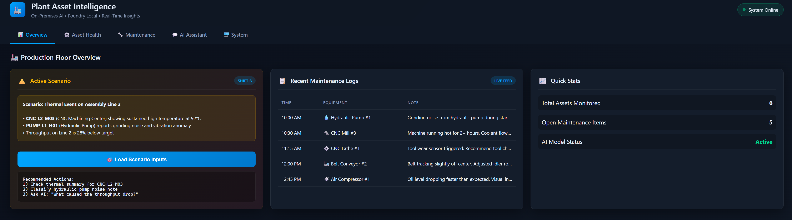
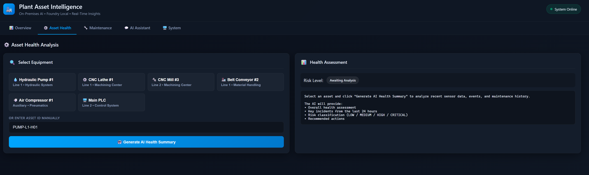
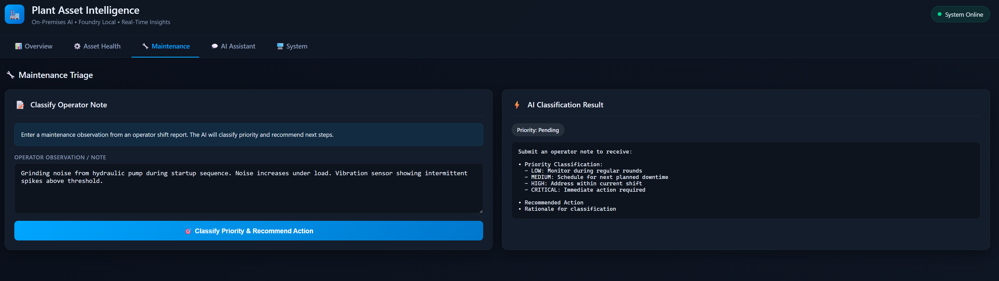
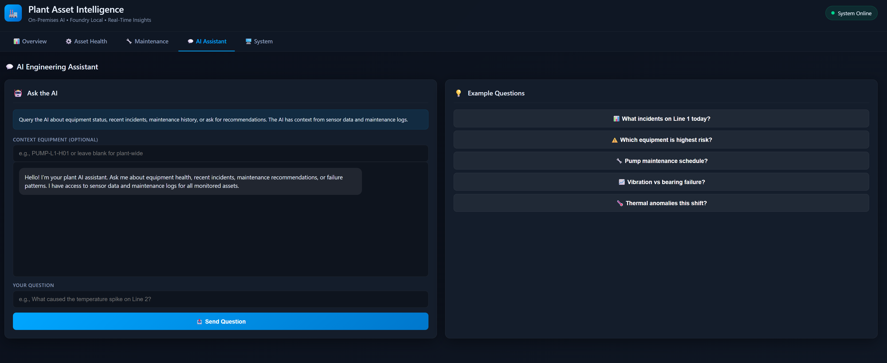
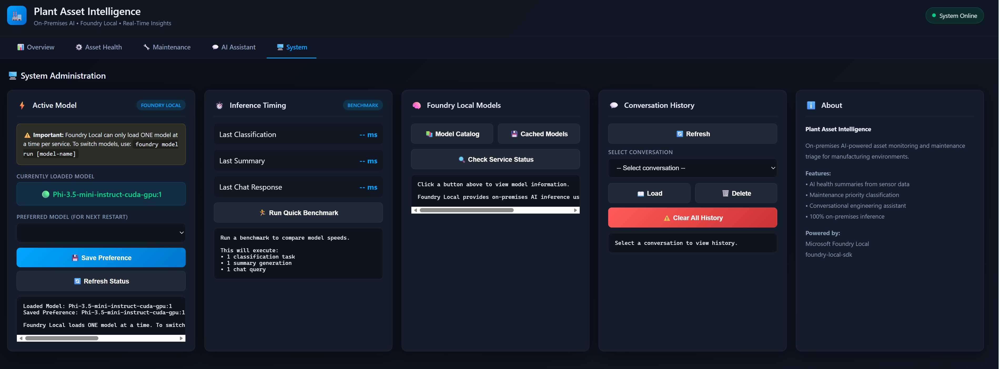

# Foundry Local Manufacturing Asset Intelligence

A JavaScript web application for on‑prem manufacturing asset intelligence using [Microsoft Foundry Local](https://github.com/microsoft/foundry-local) and the [foundry-local-sdk](https://www.npmjs.com/package/foundry-local-sdk).

## Why Local LLMs for Manufacturing & Industrial Operations?

Running AI models locally on-premises is increasingly critical for industrial and manufacturing environments. Here's why:

### 🔒 Data Security & Privacy
Manufacturing facilities generate highly sensitive data—production metrics, equipment telemetry, proprietary processes, and quality control information. Sending this data to cloud APIs exposes it to potential breaches and third-party access. **Local LLMs keep all data within your facility's network perimeter**, ensuring intellectual property and operational secrets never leave your control.

### ⚡ Low Latency for Real-Time Decisions
In manufacturing, milliseconds matter. Equipment anomalies, safety incidents, and quality defects require immediate response. Cloud-based AI introduces network latency (100-500ms round trips) that can be unacceptable for:
- Real-time predictive maintenance alerts
- Automated quality inspection decisions  
- Safety system integrations
- Process control adjustments

**Local inference delivers sub-50ms response times**, enabling true real-time AI-assisted operations.

### 🌐 Operational Resilience (No Internet Dependency)
Factory floors often have limited or unreliable internet connectivity. Critical AI capabilities shouldn't fail because of network outages. **Local LLMs operate independently of internet access**, ensuring continuous availability for:
- 24/7 shift operations
- Remote facility locations
- Air-gapped secure environments
- Disaster recovery scenarios

### 📋 Regulatory Compliance
Industries like aerospace, automotive, pharmaceuticals, and defense face strict data residency and handling regulations (ITAR, GDPR, HIPAA, FDA 21 CFR Part 11). **On-premises AI simplifies compliance** by eliminating cross-border data transfers and third-party data processing agreements.

### 💰 Predictable Costs at Scale
Cloud AI APIs charge per token/request. High-volume industrial applications—analyzing thousands of sensor readings, maintenance logs, and operator notes daily—can incur significant costs. **Local deployment offers predictable, fixed infrastructure costs** that scale economically with usage.

### 🎯 Domain Customization
Manufacturing terminology, equipment names, and operational contexts are highly specialized. Local models can be fine-tuned on your specific:
- Equipment manuals and documentation
- Historical maintenance records
- Domain-specific terminology
- Company procedures and best practices

## Prerequisites

1. **Install Foundry Local** (Windows):
   ```bash
   winget install Microsoft.FoundryLocal
   ```
   Or on macOS:
   ```bash
   brew install microsoft/foundrylocal/foundrylocal
   ```

2. **Verify Foundry Local is installed**:
   ```bash
   foundry --version
   ```

3. **Node.js 18+** installed on your machine.

## Run the application

### Quick Start for New Users

#### Option 1: Using the Startup Scripts

**PowerShell (recommended):**
```powershell
# Navigate to the project folder first
cd C:\path\to\FoundryLocal-IndJSsample

# Run the startup script
powershell -ExecutionPolicy Bypass -File .\start.ps1
```

**Command Prompt:**
```cmd
# Navigate to the project folder first
cd C:\path\to\FoundryLocal-IndJSsample

# Run the startup script
start.cmd
```

#### Option 2: Manual Step-by-Step

**PowerShell:**
```powershell
# 1. Navigate to the project folder
cd C:\path\to\FoundryLocal-IndJSsample

# 2. Go to backend folder and install dependencies
cd backend
npm install

# 3. Start the server (runs in foreground - keep this window open)
node server.js
```

Then open a **new PowerShell window** to test:
```powershell
# Test if server is running
Invoke-RestMethod http://localhost:3000/api/health
```

Finally, open the web UI by double-clicking `web\index.html` or:
```powershell
Start-Process "C:\path\to\FoundryLocal-IndJSsample\web\index.html"
```

**Command Prompt:**
```cmd
:: 1. Navigate to the project folder
cd C:\path\to\FoundryLocal-IndJSsample

:: 2. Go to backend folder and install dependencies
cd backend
npm install

:: 3. Start the server (runs in foreground - keep this window open)
node server.js
```

Then open a **new Command Prompt window** to test:
```cmd
curl http://localhost:3000/api/health
```

Finally, open the web UI:
```cmd
start ..\web\index.html
```

#### Option 3: One-Liner (Advanced)

**PowerShell (starts server in new window):**
```powershell
cd C:\path\to\FoundryLocal-IndJSsample\backend; npm install; Start-Process powershell -ArgumentList "-NoExit", "-Command", "node server.js"; Start-Sleep 5; Start-Process "..\web\index.html"
```

**Command Prompt (starts server in new window):**
```cmd
cd /d C:\path\to\FoundryLocal-IndJSsample\backend && npm install && start cmd /k "node server.js" && timeout /t 5 && start ..\web\index.html
```

### What Happens When You Start

1. **Foundry Local service** is detected (or started automatically)
2. **AI model** is loaded (phi-3.5-mini by default)
3. **Backend server** starts on http://localhost:3000
4. **Web UI** opens in your default browser

### Verify It's Working

| Check | Command | Expected Result |
|-------|---------|-----------------|
| Server health | `curl http://localhost:3000/api/health` | `{"ok":true}` |
| Foundry status | `curl http://localhost:3000/api/models/status` | `{"serviceRunning":true}` |
| List assets | `curl http://localhost:3000/api/assets` | `{"assets":["PUMP-L1-H01","CNC-L1-M01",...]}` |

### Troubleshooting

**"Port 3000 already in use"**
```powershell
# Kill process using port 3000
Get-NetTCPConnection -LocalPort 3000 | ForEach-Object { Stop-Process -Id $_.OwningProcess -Force }
```

**"Foundry Local service not running"**
```powershell
# Start the Foundry Local service
foundry service start

# Check service status
foundry service status
```

**"Foundry Local not found"**
```powershell
# Install Foundry Local
winget install Microsoft.FoundryLocal
```

**"npm not recognized"**
```powershell
# Install Node.js
winget install OpenJS.NodeJS.LTS
# Then restart your terminal
```

---

### Step-by-Step Instructions (Detailed)

#### 1) Install dependencies and start the backend

```bash
cd backend
npm install
npm start
```

The backend will:
- Start the Foundry Local service automatically
- Download the model (phi-3.5-mini by default) if not cached
- Load the model into memory
- Start the Express server on port 3000

### 2) Open the frontend

Open [web/index.html](web/index.html) in a browser (or use a local web server).

### 3) Verify health

The status badge in the header should show **Online** when the backend is running.

## Configuration

Environment variables (optional):
- `FOUNDRY_MODEL_ALIAS` — model to use (default: `phi-3.5-mini`)
- `PORT` — backend port (default: `3000`)

### Performance Tuning

> ⚠️ **Important**: Foundry Local can only load **ONE model at a time** per service instance. To run multiple models simultaneously, you would need multiple Foundry Local services on different ports with sufficient memory.

The backend uses whichever model is currently loaded in Foundry Local.

#### Model Options by Speed/Quality Tradeoff

| Model | Size | Speed | Quality | Best For |
|-------|------|-------|---------|----------|
| `qwen2.5-0.5b` | 0.5GB | ⚡⚡⚡⚡⚡ | ★★☆☆☆ | Fastest inference |
| `qwen2.5-1.5b` | 1.25GB | ⚡⚡⚡⚡ | ★★★☆☆ | Balanced speed |
| `phi-3.5-mini` | 2.1GB | ⚡⚡⚡ | ★★★★☆ | Default (recommended) |
| `phi-4-mini` | 3.6GB | ⚡⚡ | ★★★★★ | High quality |
| `qwen2.5-7b` | 4.7GB | ⚡ | ★★★★★ | Maximum quality |

#### Switching Models

To switch to a different model, you need to load it in Foundry Local:

```bash
# Stop the backend server first, then:

# Load a faster model
foundry model run qwen2.5-0.5b

# Or load a higher quality model
foundry model run phi-4-mini

# Then restart the backend
npm start
```

The UI's System tab shows which model is currently loaded.

#### Download Models

```bash
# Download the tiny 0.5B model (very fast, ~500MB)
foundry model download qwen2.5-0.5b

# Download a balanced 1.5B model (~1.2GB)
foundry model download qwen2.5-1.5b

# List all cached models
foundry model list
```

#### GPU vs CPU

Foundry Local automatically selects GPU variants when available. For best performance:
- **NVIDIA GPU**: Uses CUDA acceleration (fastest)
- **Intel GPU**: Uses OpenVINO acceleration  
- **CPU only**: Uses optimized CPU inference (slower but works everywhere)

## Screenshots 







## Scenario walkthrough
**Scenario: Thermal Event on Assembly Line 2**

This demo simulates a realistic manufacturing incident during Shift B:

| Equipment | Issue |
|-----------|-------|
| **CNC-L2-M03** (CNC Mill #3) | Sustained high temperature at 92°C, coolant flow issue suspected |
| **PUMP-L1-H01** (Hydraulic Pump #1) | Grinding noise during startup, vibration spikes above threshold |
| **Line 2 Throughput** | 28% below target due to thermal throttling |

### Equipment IDs in This Demo

| Asset ID | Equipment | Location |
|----------|-----------|----------|
| `PUMP-L1-H01` | Hydraulic Pump #1 | Line 1 |
| `CNC-L1-M01` | CNC Lathe #1 | Line 1 |
| `CNC-L2-M03` | CNC Mill #3 | Line 2 |
| `CONV-L1-B02` | Belt Conveyor #2 | Line 1 |
| `COMP-AUX-01` | Air Compressor #1 | Auxiliary |
| `PLC-L2-MAIN` | Main PLC | Line 2 |

### Try It Out

Use the **Load Scenario Inputs** button in the Overview tab, then:
1) Go to **Asset Health** tab → Generate AI summary for `CNC-L2-M03`
2) Go to **Maintenance** tab → Classify the hydraulic pump noise note
3) Go to **AI Assistant** tab → Ask: "What caused the throughput drop on Line 2?"

The sample data for this scenario lives in [data/sample-data.json](data/sample-data.json).

## API endpoints
- `GET /api/health` — check backend status
- `GET /api/assets` — list all asset IDs
- `GET /api/assets/:id/summary` — AI-generated summary for an asset
- `GET /api/logs` — list maintenance logs
- `POST /api/logs/classify` — classify a maintenance note
- `POST /api/chat` — chat with context
- `GET /api/chat/conversations` — list chat conversations
- `GET /api/chat/history?conversationId=...` — get chat history
- `DELETE /api/chat/history/:conversationId` — delete a conversation
- `DELETE /api/chat/history` — clear all chat history
- `GET /api/models/catalog` — list available models in catalog
- `GET /api/models/cached` — list downloaded/cached models
- `GET /api/models/status` — check Foundry Local service status
- `GET /api/models/config` — get current model configuration
- `POST /api/models/config` — update model configuration (fast/quality models)

## Local sample data
The backend loads sample events/logs from [data/sample-data.json](data/sample-data.json).
Chat history persists to [data/chat-history.json](data/chat-history.json).

## Admin view
Use the **Admin: Conversation Manager** card in the UI to:
- List conversations
- Load conversation history
- Delete a selected conversation
- Clear all history

## Tests
```bash
cd backend
npm test
```

